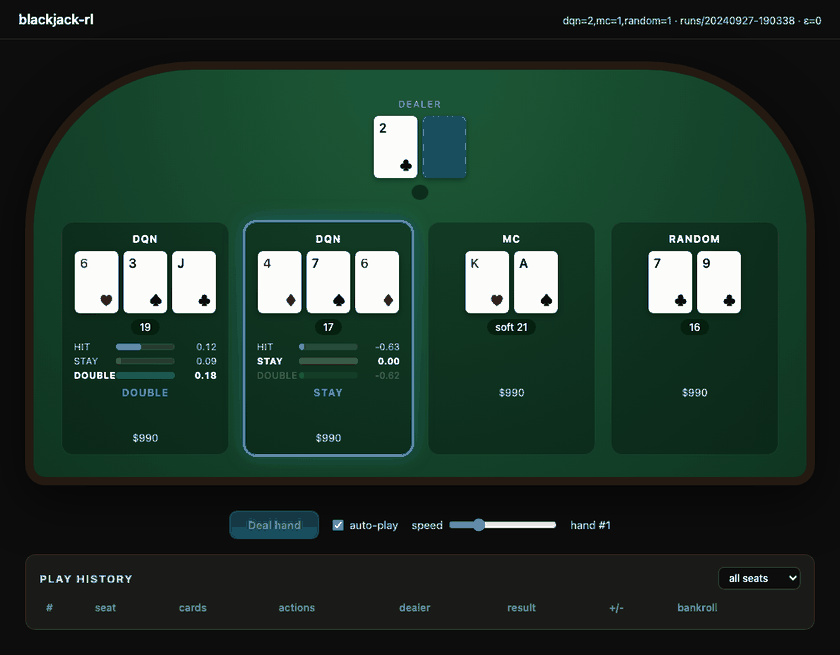
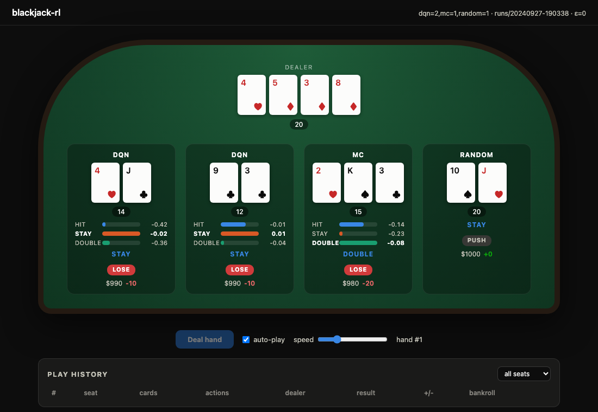
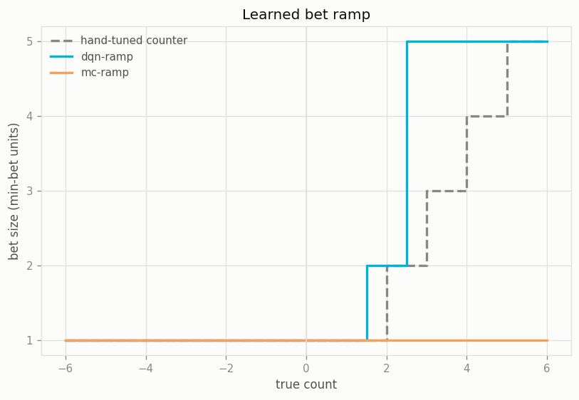

[](https://github.com/psf/black)

## blackjack rl repo

This started as a simple blackjack game and turned into a learning exercise. I wanted to build the whole ML stack for a reinforcement learning agent myself, neural network math included, and see how far it could get at the table.

Everything below the reporting layer is standard library Python. The network math (forward pass, backprop, optimizers) is written by hand and tested against worked examples and finite difference gradient checks. matplotlib is the only dependency, and it's just for plots.



### what's here

- `project/` - the game engine: cards, decks, hands, dealer, players, multi-seat tables, and a casino that runs many tables
- `neural/` - the neural network library: Linear / ReLU / LeakyReLU / Sigmoid / Dropout layers, MSE and softmax cross-entropy losses, SGD / RMSprop / Adam optimizers, and a Trainer with batching, shuffling, and validation splits
- `train/` - the RL layer: a Deep Q-learning agent and a Monte Carlo control agent built on `neural/`, heuristic baseline players, and an actor/learner setup that scales from a single process up to worker processes running dozens of tables
- `review/` - run metrics, CLI reports, matplotlib plots, and a browser board for watching trained agents play

### things I was practicing

- backprop by hand. The layer gradients are derived manually, checked with finite differences, and there's a unit test that reproduces a worked 2-2-1 example exactly
- value based RL two ways: Q-learning with a target network and replay, next to plain Monte Carlo regression. Comparison in [docs/mc-vs-dqn.md](docs/mc-vs-dqn.md)
- multiprocessing. Worker processes simulate tables and stream experience back to a learner, which broadcasts updated weights out to them
- keeping experiments honest: seeded runs, baselines in every experiment, training curves, and artifacts saved per run

## results

200,000 hands, 25 tables, 100 players, 4 worker processes. Full run averages include the exploration phase, so the numbers below are from the last 20% of hands:

| agent | hands | converged avg reward | converged win % |
| --- | --- | --- | --- |
| basic strategy* | 40,000 | +0.036 | 46.5% |
| dqn | 100,000 | +0.020 | 45.9% |
| mc | 50,000 | +0.008 | 45.6% |
| aggressive | 26,000 | -0.247 | 34.5% |
| random | 24,000 | -0.281 | 32.8% |

\* textbook H17 basic strategy, evaluated separately under the same rules.

Both learners end up about 13 points of win rate above the naive baselines and slightly EV positive because of this engine's dealer rule (see house rules). Textbook basic strategy still edges them out. The agents match it on 77% (dqn) and 71% (mc) of states, and the full comparison, the disagreement charts, and when I'd pick each algorithm are in [docs/mc-vs-dqn.md](docs/mc-vs-dqn.md).



### can they learn to count?

The follow up question was whether an agent could work out when to raise its bet, which needed two things it didn't have: the running count in its observation, and control of the bet at all. Flat bets plus a reward normalised by bet size meant wagering was invisible to the objective.

Given both, `dqn-ramp` learned a real bet ramp. It bets the table minimum below a true count of +1 and jumps straight to the five unit cap from +3 up, which is sharper than the textbook Hi-Lo staircase and worth more per hand than it (+0.075 vs +0.071 units):



Then I tried to replicate it and mostly couldn't. Across eight independent ramp learners under the same rules, two found a usable rising ramp, one learned it *backwards*, and five never left the table minimum — including a rerun on the same seed as the chart above. The variance arithmetic explains it: the edge separating a five unit bet from a one unit bet is about 0.10 units, and the noise on a five unit bet is about 4.9, so resolving it needs roughly an order of magnitude more hands than these runs had.

The replication is the real result, and it's the more useful one. Two other findings came out of the same work: count-aware play didn't reliably beat count-blind play (deviations are worth +0.002 units/hand here, well under the noise floor), and chasing the doubling numbers turned up a reward-scale bug that had been quietly costing every learner money since long before this experiment. Full writeup in [docs/card-counting.md](docs/card-counting.md).

## how to run:

```shell
pipenv shell
pip install -r requirements.txt

# run the multi-table casino demo with heuristic players
python main.py

# train agents synchronously (single process, reproducible per seed)
python -m train.main --agents "dqn=2,random=1,noob=1" --workers 0 --tables 1 --hands 20000 --seed 7

# train at scale with multiprocessing: 25 tables, 100 players, 4 worker processes
python -m train.main --agents "dqn=50,mc=25,aggressive=13,random=12" --workers 4 --tables 25 --hands 200000 --seed 7

# train counting agents against the fixed counter, under the conventional dealer rule
python -m train.main --agents "dqn-ramp=14,dqn-count=8,dqn=8,counting=10,basic=10" \
  --workers 4 --tables 20 --hands 400000 --seed 7 --dealer-rule s17

# re-print a run report, render plots, or compare runs (defaults to the latest run)
make report
python -m review.report runs/<timestamp> --plots
python -m review.report runs/<timestamp> --tail 0.2 --counts
python -m review.report runs/<first> runs/<second>

# watch trained agents play on a live board in the browser (defaults to the latest run)
make board
make board AGENTS="dqn=2,mc=1,random=1"
```

Every training run writes `runs/<timestamp>/` with `config.json`, `metrics.jsonl`, `loss.jsonl`, learned weights per agent kind, `report.txt`, and `plots/*.png` (training loss, rolling win rate, reward comparison, result breakdown, bankroll trajectories, the exploration schedule, and, when counting agents are seated, the learned bet ramp and wager-by-count charts).

`--tail 0.2` scopes a report to the last 20% of each agent's hands, which is where converged behaviour lives once epsilon has decayed. `--counts` adds a breakdown of bet size and profit by true count.

The board is a local page served with the stdlib `http.server`, no extra dependencies. It animates each hand card by card, shows the network's live value estimates for hit / stay / double while the agent decides, and keeps a filterable play history per seat. Add `?auto=1` to the URL to start dealing on load.

## agents

- `dqn` - Deep Q-learning: the network predicts a value per action, trained off an experience replay buffer with a target network and epsilon-greedy exploration
- `mc` - Monte Carlo control: the network regresses observed episode returns for each state/action visited
- `dqn-count` / `mc-count` - the same learners with the running true count added to their observation, so count-conditioned deviations are learnable
- `dqn-ramp` / `mc-ramp` - count-aware play plus a second network that picks the bet, one to five units, before the cards come out
- `basic` - textbook H17 basic strategy adapted to this action space, the strongest fixed benchmark
- `counting` - hi-lo card counter: basic strategy plus count-driven deviations, betting one to five units with the true count. The tables here play the shoe to the last card, so the count gets sharp late
- `noob` / `apprehensive` / `aggressive` / `random` - heuristic baselines (always hit, always stay, double when funded, and uniformly random)

Learning agents see their hand total, a soft ace flag, the dealer upcard, and whether double down is available. The `-count` and `-ramp` variants also see the true count, scaled into [-1, 1].

Rewards come in two scales, which turns out to matter. The play network trains on net profit as a fraction of the bet, so its target is bet-size invariant and it learns how to play a hand rather than how much to wager. The bet network trains on net profit in units of the table minimum, which is the only way bet sizing can show up in the objective at all.

That first normalisation has a catch worth knowing about: dividing by the *final* bet also prices a double down at zero, since a doubled loss and a flat loss both come out at -1. `--reward-scale initial_bet` divides by the opening bet instead, so doubling is worth ±2 the way it should be. The default is left alone so earlier runs stay comparable. Full writeup in [docs/card-counting.md](docs/card-counting.md).

## house rules

- by default the dealer hits any hand that could still total 16 or less, so soft 17 through soft 20 all get hit. It busts a lot, and the trained agents learn to take advantage of exactly that
- `--dealer-rule h17` and `--dealer-rule s17` swap in the conventional rules for comparison. They matter more than they look: the house rule above hands the player a positive edge before any counting, and the standard ones take it back
- a natural blackjack (two-card 21) pays 3:2, and a drawn 21 is an ordinary win
- dealer bust pays even money, pushes return the stake
- actions are hit, stay, and double down. Bets are flat at the table minimum unless an agent sizes them, capped at five units
- training tables re-buy busted players back to their starting bankroll and count the re-buys. The demo casino plays with real bankroll elimination

Synchronous runs (`--workers 0`) are reproducible bit for bit under a given seed. Parallel runs seed each worker deterministically, but process interleaving means exact replays aren't possible.

## development

```shell
make test      # unit tests across all four packages
make lint      # pylint via .pylintrc
make lint-fix  # black + isort, then pylint
```
