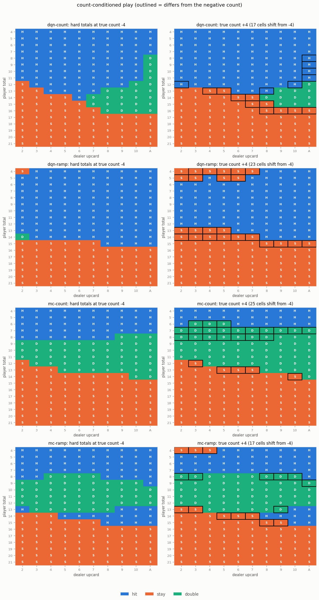

# card counting

The earlier experiment had every agent betting a flat 10 chips, which quietly removed the one thing a card counter actually does for a living. This is the follow up: put the running count in front of the agents, hand them control of the bet, and see whether they work out when to push.

Short version: one run produced a beautiful bet ramp, sharper than the textbook one and worth more per hand. Then I tried to replicate it and mostly couldn't — two of eight independent ramp learners found a usable ramp, one learned it backwards, and the rest never left the table minimum. The variance arithmetic says that's exactly what should happen at this sample size, which is the actual result here. Chasing the numbers also turned up a reward-scaling bug that had been quietly costing every agent money since well before this experiment.

## what a counter is actually doing

There are two separate jobs, and they are not equally valuable.

**Playing deviations.** When the shoe is rich in tens, some decisions flip. Standing on 16 against a 10 is the famous one. These are worth something, but not much.

**Bet sizing.** Bet small when the shoe is bad, big when it's good. This is where the money is, because it's the only lever that changes how much is at stake rather than how well you play what's in front of you.

Splitting them apart in this engine, 400,000 hands each, using the hand-tuned Hi-Lo counter's own rules:

| variant | units/hand (house rule) | units/hand (s17) |
| --- | --- | --- |
| basic strategy, flat bet | +0.0256 | -0.0261 |
| deviations only, flat bet | +0.0275 | -0.0250 |
| bet ramp only | **+0.0680** | **-0.0219** |
| deviations + ramp | +0.0749 | -0.0181 |

The ramp does 96% of the work under the house rule. That tracks the usual rule of thumb for real counters, and it means an agent that can see the count but can't size its bet is playing for the scraps.

## the reward scale problem

This is the part that had to change before the question was even askable.

The original reward was the hand's net profit *as a fraction of the bet*. The intent was reasonable: make the target bet-size invariant so a 50 chip win and a 10 chip win teach the same lesson about standing on 16, and the network can concentrate on how to play rather than how much is riding on it.

But it makes bet sizing completely invisible. Win a unit at a bet of 1 and the reward is +1. Win a unit at a bet of 5 and the reward is still +1. Under that objective there is no reason to ever raise, because raising doesn't show up.

So there are two reward scales now:

- the **play network** trains on net profit / bet, and learns how to play a hand
- the **bet network** trains on net profit / table minimum, which is the only scale where wagering more can pay more

Keeping both is what lets one agent learn both jobs without either signal drowning the other. It also turns out that the normalisation blinds the play network to more than just the bet, which is the last section of this page and the thing I'd fix first.

## what I built

`Card.hi_lo_value` and `Hand.hi_lo_count` give the +1 / 0 / -1 tags. The table keeps a running count that folds in every hand at settlement, tracks a shuffle epoch so the count resets when the shoe is recycled, and divides by decks remaining for the true count. Mid-hand the count only includes cards that are face up, so the dealer's hole card stays hidden the way it should.

Agents come in three tiers now, and the point of the tiers is that they're a controlled comparison. All of them sit at the same tables, seeing the same shoes, in the same run:

- `dqn` / `mc` - 4 features, flat bet. The control, unchanged from before
- `dqn-count` / `mc-count` - 5 features, the true count added, flat bet. Isolates the value of deviations
- `dqn-ramp` / `mc-ramp` - 5 features plus a second network that picks the bet before the cards come out

The bet network is small: 2 inputs (true count, decks remaining), 5 outputs, one per unit level. It's trained as a contextual bandit rather than an RL problem, because the bet decision has no successor state. The target is just the observed return, no bootstrapping.

Two things I got wrong on the first pass and had to fix:

A hand that ends in a natural has no decisions in it, so it was being dropped before it reached any learner. Fine for the play network, quietly bad for the bet network, because naturals are the best outcomes and they arrive disproportionately when the count is high. Dropping them biases the estimate downward exactly where it matters.

And when a short bankroll clamps the wager, the outcome of a 3 unit bet was being credited to whichever level the policy asked for. That's 2.4% of ramp hands, landing almost entirely on the largest bet. Both fixed, both worth mentioning because both were silent.

## what the count is worth in this game

Before asking what the agents learned, it's worth knowing what there was to learn. Basic strategy, 400,000 hands, EV per unit wagered by true count:

| true count | ≤-5 | -4 | -3 | -2 | -1 | 0 | +1 | +2 | +3 | +4 | ≥+5 |
| --- | --- | --- | --- | --- | --- | --- | --- | --- | --- | --- | --- |
| house rule | -.025 | -.010 | +.020 | +.021 | +.021 | +.029 | +.030 | +.038 | +.027 | +.032 | +.081 |
| s17 | -.069 | -.043 | -.032 | -.027 | -.025 | -.024 | -.028 | -.023 | -.021 | -.023 | +.019 |

Standard errors run .004 to .008, so the shape is real even where individual buckets wobble. The end buckets are catch-alls, and they're crowded because these tables deal the shoe to the last card, which sends the true count to extremes as the divisor shrinks.

The count is informative under both rules: EV climbs monotonically with it, give or take noise. But *where it crosses zero* is completely different, and that changes the right answer:

- under the **house rule** the dealer hits every soft hand through soft 20 and busts constantly, so the player is already ahead at a neutral count. Basic strategy is +EV in every bucket from -3 up, which makes the EV-maximising bet *max almost always*
- under **s17** the player is behind everywhere except the top bucket, which makes it *minimum almost always*

Which produces a genuinely useful check: the same architecture, same reward, same everything, should learn opposite betting behaviour under the two rules. If it does, it learned something about the game rather than about the bet levels.

Simulating each betting scheme directly, again with basic strategy play, 400,000 hands:

| betting scheme | units/hand (house rule) | units/hand (s17) |
| --- | --- | --- |
| flat 1 unit | +0.0256 | -0.0261 |
| hand-tuned Hi-Lo ramp | +0.0680 | -0.0219 |
| always max (5 units) | **+0.1279** | -0.1304 |
| oracle threshold | +0.1411 | **-0.0178** |

The hand-tuned Hi-Lo ramp is *mistuned for this game*. It starts raising at +2 because that's roughly where a real counter crosses into profit in a real casino. Here the crossing point is around -3, so the textbook ramp captures barely half of what simply shoving every hand would earn. That's not a bug in Hi-Lo, it's Hi-Lo being applied to a game it wasn't derived for, which is exactly the trap a learned policy should be able to avoid.

(Later tables score policies against the bucketed EV numbers above rather than re-simulating, which shifts the hand-tuned figure from +0.068 to +0.071. The gap between methods is small enough that the ordering holds either way.)

## what the agents learned

Two runs, 400,000 hands each, 20 tables, 4 worker processes, seed 7. Every agent kind sits at the same tables seeing the same shoes. Numbers are the last 20% of each agent's hands, after epsilon decayed.

**House rule (dealer hits every soft hand):**

| agent | ev/unit | avg bet | units/hand |
| --- | --- | --- | --- |
| basic strategy | +0.0346 | 1.00 | +0.0517 |
| hand-tuned counter | +0.0323 | 1.70 | **+0.1140** |
| dqn | -0.0037 | 1.00 | -0.0515 |
| dqn-count | +0.0032 | 1.00 | -0.0414 |
| dqn-ramp | +0.0179 | 2.17 | -0.0226 |
| mc | +0.0064 | 1.00 | -0.0534 |
| mc-count | +0.0024 | 1.00 | -0.0836 |
| mc-ramp | +0.0149 | 1.42 | -0.0728 |

**Standard rule (s17):**

| agent | ev/unit | avg bet | units/hand |
| --- | --- | --- | --- |
| basic strategy | -0.0318 | 1.00 | -0.0226 |
| hand-tuned counter | -0.0274 | 1.69 | **+0.0029** |
| dqn | -0.0504 | 1.00 | -0.0709 |
| dqn-count | -0.0684 | 1.00 | -0.0827 |
| dqn-ramp | -0.0547 | 2.03 | -0.1635 |
| mc | -0.0544 | 1.00 | -0.1544 |
| mc-count | -0.0750 | 1.00 | -0.1756 |
| mc-ramp | -0.0552 | 1.14 | -0.1418 |

Three things fall out of this.

### the bet ramp is sometimes learnable, and the shape is not the textbook one

Reading the greedy policy straight off `dqn-ramp`'s bet network under the house rule, at every level of shoe penetration:

It bets the minimum up to a true count of +1, two units at +2, and then jumps straight to the five unit cap from +3 onward. That's a step function, not a staircase, and the step is the structurally right shape: with no bankroll constraint and no reason to disguise itself, pure EV maximisation says bet the minimum below the crossover and the maximum above it. The hand-tuned Hi-Lo ramp spreads its increase over four count levels because human counters care about ruin risk and about not being obvious. The network has neither concern and doesn't hedge.

Scoring each betting scheme against the measured EV-by-count table:

| betting scheme | units/hand (house rule) | units/hand (s17) |
| --- | --- | --- |
| flat 1 unit | +0.0256 | -0.0261 |
| hand-tuned Hi-Lo ramp | +0.0712 | -0.0245 |
| **what dqn-ramp learned** | **+0.0752** | **-0.0261** |
| always max (5 units) | +0.1279 | -0.1304 |
| oracle threshold | +0.1410 | -0.0178 |

So it beats the textbook ramp under the house rule, and under s17 it avoids the catastrophe that always-max would have been (-0.130). But it is *too conservative in both*. It captures 53% of what simply shoving every hand would earn under the house rule, because it put its threshold at +3 when the real crossover is down at -3. Under s17 it ties flat betting rather than picking up the oracle's improvement, which needs raising in the top bucket only.

The pattern is the same both times: it learned "raise when the count is clearly high," not "raise whenever the edge is positive." The small positive edges at low counts are real but buried in noise, so the network never finds them, and the threshold it can see lands well above the one that matters.

That said, the direction of adaptation is right. Under the house rule it ramps up; under s17, where the player is behind at almost every count, the same setup ends up betting the minimum everywhere instead. Same code, same reward, opposite behaviour, driven entirely by the EV landscape it found. The s17 agent got there unsteadily though — it swung back up to near-max betting partway through the last fifth of training before collapsing back to the minimum, so "learned" is generous. More on that below.

The first caveat is that `mc-ramp` did not learn it. Both ramp agents use an *identical* bet learner — same class, same hyperparameters, same seed — so the difference isn't MC versus DQN at betting. The only thing that differs is the play network feeding it hands.

### and then it mostly didn't replicate

That chart was a good enough result that I went to check it, with three more runs at 200,000 hands each, seeded 7 / 23 / 101, ramp agents only so each one gets 100,000 hands instead of 70,000. Greedy bet by true count, read off each trained bet network:

| seed | agent | -5 | -4 | -3 | -2 | -1 | 0 | +1 | +2 | +3 | +4 | +5 | units/hand |
| --- | --- | --- | --- | --- | --- | --- | --- | --- | --- | --- | --- | --- | --- |
| 7 | dqn-ramp | 1 | 1 | 1 | 1 | 1 | 1 | 1 | 1 | 1 | 1 | 1 | +0.0256 |
| 7 | mc-ramp | 1 | 1 | 1 | 5 | 5 | 5 | 5 | 1 | 1 | 1 | 1 | +0.0787 |
| 23 | dqn-ramp | 1 | 1 | 1 | 1 | 1 | 1 | 1 | 1 | 1 | 1 | 1 | +0.0256 |
| 23 | mc-ramp | 4 | 4 | 4 | 1 | 2 | 2 | 2 | 2 | 2 | 2 | 2 | +0.0450 |
| 101 | dqn-ramp | 1 | 1 | 1 | 1 | 1 | 1 | 1 | 1 | 1 | 1 | 2 | +0.0346 |
| 101 | mc-ramp | 1 | 1 | 1 | 1 | 1 | 1 | 1 | 1 | 4 | 4 | 4 | +0.0607 |
| | *flat reference* | 1 | 1 | 1 | 1 | 1 | 1 | 1 | 1 | 1 | 1 | 1 | +0.0256 |
| | *hand-tuned Hi-Lo* | 1 | 1 | 1 | 1 | 1 | 1 | 1 | 2 | 3 | 4 | 5 | +0.0712 |

Counting the original run, that's eight independent ramp learners under the house rule. **Two found a usable rising ramp.** Three never left the table minimum, which is just flat betting with extra steps. One (seed 23) learned it *backwards*, betting four units at the worst counts. One (seed 7's `mc-ramp`) learned a bump in the middle of the count range, which is meaningless as a policy but happens to score well because the middle buckets hold most of the hands and are all positive EV — a good reminder that scoring a policy is not the same as it having learned anything.

The most pointed line in that table is the first one. Seed 7 `dqn-ramp` is the *same seed* as the run that produced the clean step function, with more hands, and it flatlined. What changed was the table composition, which is to say nothing that should matter. The step function was mostly luck.

So the honest answer to "can they work out when to raise" is: sometimes, at this sample size, and you cannot tell which run got lucky without a reference to check it against. Which is precisely what the variance arithmetic below predicts, and it's why I'd trust the ceiling table over any individual chart.

### the count barely moved the playing decisions, and it shouldn't have

`dqn-count` beat `dqn` in one of four comparisons and lost the other three. That reads like a failure until you check what was on offer: measured directly, playing deviations are worth **+0.0019 units per hand** in this game. The standard error on an 8,000 hand sample is about 0.011. The effect is five times smaller than the noise floor, so detecting it reliably would need roughly 250,000 hands per agent, and nothing here had that.

The deviations do show up in the policy itself even where they don't show up in the money. Every count-aware agent shifts its stand line upward when the shoe goes rich, standing on 13 through 16 against cards it would hit at a negative count, which is the direction the Illustrious 18 says to move:

### the expensive mistake was doubling, and the reward scale was hiding it

This is the one I did not go looking for. Splitting the house-rule run by whether the hand was doubled:

| agent | double % | ev/unit when doubling | ev/unit otherwise |
| --- | --- | --- | --- |
| basic strategy | 10.0% | **+0.171** | +0.019 |
| hand-tuned counter | 11.3% | **+0.204** | +0.010 |
| dqn | 12.7% | **-0.377** | +0.050 |
| dqn-count | 12.5% | -0.357 | +0.055 |
| dqn-ramp | 9.5% | -0.350 | +0.057 |
| mc | 38.7% | -0.155 | +0.108 |
| mc-count | 42.8% | -0.201 | +0.155 |
| mc-ramp | 43.2% | -0.159 | +0.147 |

On hands they don't double, every learner is *better* than basic strategy per unit. Then they double, and it's a bloodbath. MC doubles four out of ten hands, which explains a lot about the swings in the earlier writeup.

The reason is the reward normalisation, and it's the same blind spot the bet network was built to fix. Reward is net profit over the *final* bet. Double down and lose: net is -2 units, final bet is 2 units, reward is -1. Don't double and lose: net is -1, bet is 1, reward is -1. **Identical.** Winning is symmetric: both cases give exactly +1. So doubling changes the stake and changes nothing at all in the training signal. The network's entire preference for it comes from the "take exactly one more card and stop" mechanics, with the doubled stake priced at zero.

Which means the play network was never told that doubling costs anything, and the flat-bet metric couldn't show the damage either, because it normalises the same way. The units-per-hand column is what makes it visible: `dqn` has an ev/unit of -0.004 but bleeds -0.052 units per hand, and the gap is almost entirely doubled hands.

`--reward-scale initial_bet` divides by the opening bet instead, so a doubled loss trains on -2 and a doubled win on +2. The default is unchanged so the earlier results stay comparable.

## why the bet ramp is hard to learn

Worth writing down, because the arithmetic predicts the wobble.

The bet network is estimating the expected return of each bet level. Expected return at *b* units is just *b* times the per-unit edge, so the thing separating "bet 5" from "bet 1" under the house rule is 5 × 0.026 - 0.026 ≈ 0.10 units. But the noise scales with the bet too: per-hand standard deviation is 0.99 units at one unit, so about 4.9 at five units.

Getting the standard error on the five-unit estimate down to a third of that 0.10 gap needs roughly (4.9 × 3 / 0.10)² ≈ 21,000 samples of that action alone. Spread across five bet levels and eleven count buckets, with 70,000 to 100,000 hands per ramp agent, that is right at the edge of resolvable — and "right at the edge" is a description of a coin flip, not of a method.

Which is the whole story. Two of eight found the ramp, one found it inverted, five stayed flat, and the run I'd have written up as a clean success if I hadn't checked was the same seed as one that flatlined. Nothing about the agents changed between those two; only how many samples happened to land on the right side of the noise.

The signal a counter is chasing is small and the variance it's buried in grows with the size of the bet you'd use to exploit it. That's the whole problem in one sentence, and it's why human counters use a formula off a precomputed table instead of learning the ramp from their own results.

## what I'd do differently

Price the double properly by default. `--reward-scale initial_bet` exists now, but it should probably be the default, and the older results should be re-run under it. The current normalisation makes hit and stand easy to learn by removing a nuisance variable, and it happens to remove the entire cost of the one action that changes the stake.

Give the bet learner a variance reduction. Expected return is exactly linear in bet size, so estimating one number per count (the per-unit edge) and deriving the bet from it would collapse five noisy estimates into one and cut the sample requirement by most of an order of magnitude. I deliberately didn't do that here because handing the model the linear structure is close to handing it the answer, and I wanted to see whether the bandit could find the ramp on its own. It can, sometimes, which is the more interesting result, but it isn't how I'd build it if I wanted the ramp to work.

Cut the shoe earlier. These tables deal to the last card, which sends the true count to absurd values as the divisor collapses and stuffs the extreme buckets with hands no real game would produce. A cut card at 75% penetration would make the count distribution realistic and the tail buckets meaningful.

Replicate before writing anything up. I nearly published the step function as the headline. Three more runs turned it into a coin flip, and the coin flip is the more useful finding — it puts a number on how much data this kind of bet-sizing question actually needs, which is roughly an order of magnitude more than I gave it.
