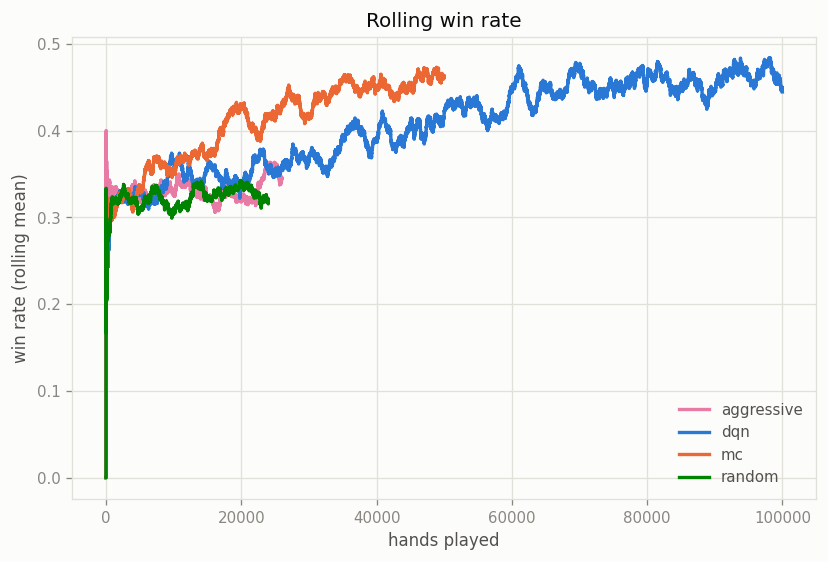
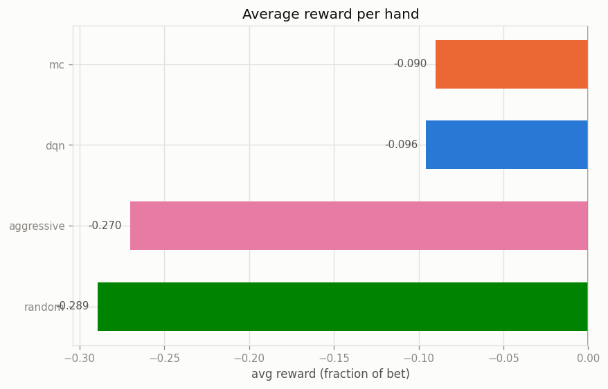

# monte carlo control vs deep q-learning

Both agents use the same network from `neural/`: 4→32→32→3, ReLU, Adam at 1e-3, 1,315 parameters. Same observation (hand total, soft ace flag, dealer upcard, whether double is available), same epsilon schedule, same reward (net profit on the hand as a fraction of the bet). The only difference is the target they train toward, so this ends up being a pretty clean comparison of the two ideas.

## the two targets

Monte Carlo waits until the hand is over, then trains every state/action from that hand toward the return that actually happened. There is no estimate inside the target. It's just regression on real outcomes, with no target network or anything else bolted on.

DQN updates after every action using its own guess about the next state: `target = reward + gamma * max Q_target(next state)` over the legal actions. The replay buffer and the periodically synced target network exist to keep that self reference from blowing up, and each update only touches the action that was actually taken.

## results

From the 200,000 hand run (25 tables, 100 players, 4 worker processes, seed 7):

| agent | hands | full run avg reward | converged avg reward* | converged win % | converged bust % |
| --- | --- | --- | --- | --- | --- |
| dqn | 100,000 | -0.096 | **+0.020** | 45.9% | 14.8% |
| mc | 50,000 | -0.090 | **+0.008** | 45.6% | 10.4% |
| aggressive | 26,000 | -0.270 | -0.247 | 34.5% | 37.9% |
| random | 24,000 | -0.289 | -0.281 | 32.8% | 32.4% |

\* last 20% of each agent's hands, after epsilon decayed. The full run average includes the early exploration phase, so it understates the final policy.

They converge to basically the same play, about 13 points of win rate above random. The positive EV is real but it comes from the house rules: the dealer here hits any hand that could still total 16 or less, which includes soft 17 through soft 20. It busts constantly, and both agents learn to stand on stiff hands and wait for that to happen. MC busting less (10.4% vs 14.8%) is the same lesson learned a little more conservatively.

MC also got there with about half the hands, which you can see in its steeper early curve. With only 1 to 5 decisions per hand, the episode result is nearly as good a signal as a bootstrapped per step target, so MC barely pays anything for being simple. DQN trained smoothly, but its extra machinery mostly bought stability rather than better play.

## which one I'd use

MC when hands are short and the reward only shows up at the end, which is exactly blackjack. The targets are unbiased, training is ordinary regression, and there are fewer things to mistune since there's no target network and no bootstrap bias to chase. It's also easier to debug, because a weird target always traces back to a hand that actually happened.

DQN when episodes get long or rewards arrive mid episode. Waiting for the end makes MC targets noisier as hands get longer (one lucky dealer bust rewards every action in the hand equally), while bootstrapping hands out credit per step. The replay buffer also squeezes more out of each experience, which matters when data is expensive instead of simulated for free.

For this game MC is the better deal for the effort. DQN was still the more useful one to build, because the target network and masked target details are where things actually go wrong in practice.
